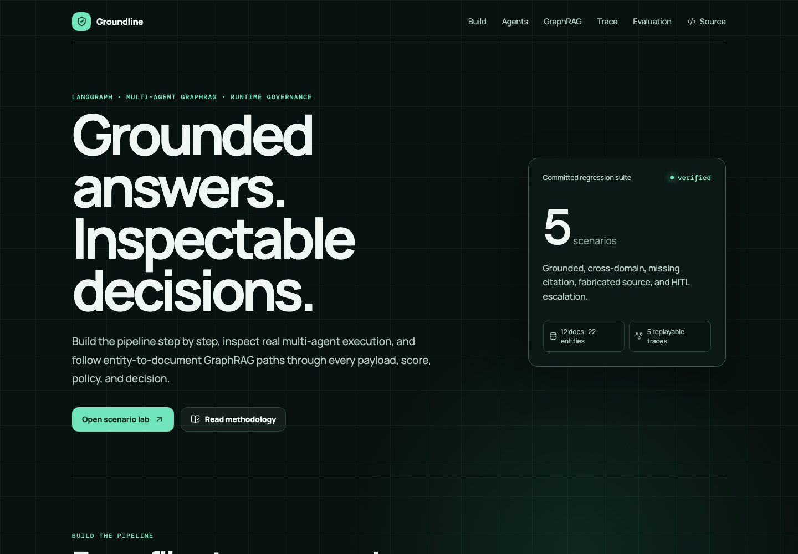
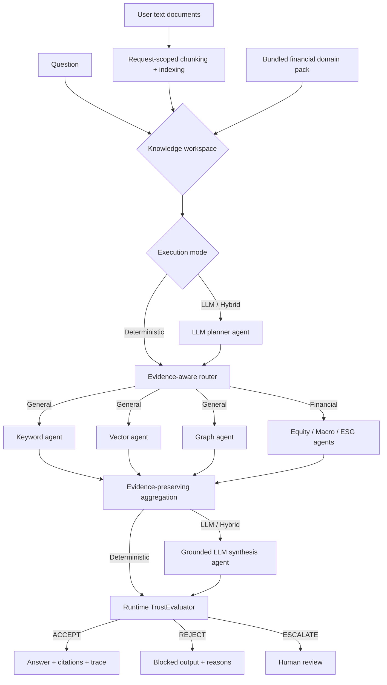

# Governed Multi-Agent RAG

A reproducible, API-key-free **governed multi-agent RAG** framework for arbitrary document corpora. It combines request-scoped indexing, keyword/vector/graph retrieval agents, source-linked traversal, typed boundaries, citation verification, runtime trust evaluation, human escalation, and audit trails.

**[Open the live Groundline app](https://danielchen26.github.io/governed-multi-agent-rag/)** · **[Live API docs](https://groundline-api-production.up.railway.app/docs)** · [View CI](https://github.com/danielchen26/governed-multi-agent-rag/actions)

> Portfolio status: working engineering prototype, not a production SLA. The bundled financial domain pack is synthetic; user-provided document workspaces are ephemeral and are not persisted.



## Product objective

Groundline helps teams safely evaluate multi-agent RAG over any text corpus by making every route, source, citation, policy check, and trust decision inspectable before output reaches users.

The public app supports three paths:

- **General document workspace:** paste or import up to 20 TXT, Markdown, CSV, or JSON sources within a 120,000-character request budget. Documents are chunked and indexed only inside the request and are not persisted.
- **Optional real LLM agents:** select deterministic, hybrid, or strict LLM execution. Hybrid uses a LangGraph model planner and grounded synthesis agent, then falls back safely if the configured provider fails.
- **Financial domain pack:** run live questions against 12 clearly labeled synthetic financial documents.
- **Deterministic replay:** inspect five committed financial regression traces, including unsafe and human-escalation cases.

The public runtime requires no account or API key and is rate-limited to protect the demonstration service.

## React application

The `frontend/` directory contains **Groundline**, a responsive React + TypeScript system walkthrough connected to the public API. Five replayable traces generated from real executions remain available if the service is unavailable or a reviewer wants deterministic failure cases.

Interactive surfaces include:

- general request-scoped document workspace with file import and paste support
- dynamic keyword, semantic, and graph retrieval strategy routing
- scenario lab for grounded, cross-domain, missing-citation, fabricated-source, and HITL paths
- animated node-by-node execution replay with previous/next controls
- seven-stage build walkthrough covering corpus, indexes, graph construction, orchestration, GraphRAG, governance, and delivery
- interactive multi-agent choreography with state contracts, tools, reducer behavior, and failure modes
- exact router, GraphRAG agent, schema-gate, aggregation, and trust-evaluator payloads
- interactive knowledge-graph explorer showing seed entities, traversed relationships, source provenance, and document boosts
- per-document BM25, neural-vector, title, graph, and combined retrieval scores
- function-call and runtime-policy inspector
- interactive concept explorer covering boundaries, grounding, fan-out, and escalation
- cURL, Python, and JavaScript API examples
- filterable 20-case evaluation table with per-case metrics

The hosted interface executes new queries against:

```text
https://groundline-api-production.up.railway.app
```

To run the complete stack locally:

```bash
# Terminal 1 — API
make serve

# Terminal 2 — React app
make frontend-install
make frontend-dev
```

Open `http://127.0.0.1:5173`. Override the API URL through `frontend/.env` using `VITE_API_URL`.

Production-build Lighthouse audit: **99 Performance · 100 Accessibility · 100 Best Practices**.

## Why this project exists

Multi-agent retrieval systems can fail even when individual agents appear useful: routers select the wrong domain, agent output formats drift, citations are missing or fabricated, confidence is poorly calibrated, and errors become hard to locate. This project turns governance from an offline checklist into executable runtime nodes.

## Architecture



## Implemented capabilities

- General `/general/query` endpoint for request-scoped user documents with no server-side persistence
- `deterministic`, `hybrid`, and strict `llm` execution modes
- Real LangGraph LLM planner and grounded synthesis nodes through an OpenAI-compatible provider
- Provider failure isolation: Hybrid mode safely falls back; strict LLM mode returns an explicit 503
- Deterministic chunking plus per-request BM25, TF-IDF vector, and concept-graph indexes
- Evidence-aware routing across keyword, semantic, and graph retrieval agents
- Dynamic source-linked concept graph returned with every general workspace response
- Real LangGraph `StateGraph` with dynamic `Send` fan-out and reducer-based aggregation for the financial domain pack
- Domain router for equity, macroeconomic, and ESG questions
- Source-linked financial knowledge graph with 22 entities, 24 relationships, validation, query entity linking, and one-hop traversal
- Graph-aware score fusion: 38% BM25 + 32% vector + 12% title + 18% graph signal
- Pluggable vector retrieval: local TF-IDF or Ollama/Qwen3 neural embeddings
- Pydantic agent contracts requiring citations, confidence, quality, and source identity
- Exact quote/source validation against the indexed corpus
- Evidence-support, route-validity, citation-coverage, and confidence checks
- Deterministic `ACCEPT / REJECT / ESCALATE` decisions
- Structured audit events and node-level input/output/call traces for every graph stage
- Controlled fault injection for missing citations, fabricated sources, and low confidence
- FastAPI service, CLI, Dockerfile, pytest suite, GitHub Actions CI, and reproducible evaluation
- React + TypeScript demonstration with live API queries and a static recorded-run mode

## Quick start

```bash
git clone https://github.com/danielchen26/governed-multi-agent-rag.git
cd governed-multi-agent-rag
uv sync --extra dev --no-editable
uv run governed-rag query "What drove Northstar's cloud revenue growth?"
```

Run a controlled safety test:

```bash
uv run governed-rag query "What was Northstar revenue?" --fault no_citation
```

Use locally hosted neural embeddings through Ollama:

```bash
ollama pull qwen3-embedding
uv run governed-rag query "What drove cloud revenue?" --embedding-backend ollama
```

Run the evaluation suite:

```bash
uv run governed-rag-eval
```

Start the API and query your own document:

```bash
uv run uvicorn governed_rag.api:app --reload
curl -X POST http://127.0.0.1:8000/general/query \
  -H 'Content-Type: application/json' \
  -d '{
    "query":"When does the Ares mission launch?",
    "documents":[{
      "title":"Mission brief",
      "text":"The Ares mission launches in September 2028 and will collect polar ice samples."
    }]
  }'
```

The built-in financial domain pack remains available at `POST /query`.

### Enable real LLM agents

The deterministic runtime needs no key. To enable Hybrid and strict LLM modes, configure server-side secrets:

```bash
export GOVERNED_RAG_LLM_PROVIDER=openai-compatible
export GOVERNED_RAG_LLM_BASE_URL=https://api.openai.com/v1
export GOVERNED_RAG_LLM_MODEL=gpt-4.1-mini
export GOVERNED_RAG_LLM_API_KEY=your-server-side-key
```

Then include `"mode":"hybrid"` or `"mode":"llm"` in `POST /general/query`. The planner receives the question and document manifest; the synthesis agent receives only deterministically retrieved excerpts. Keys are never returned to the client.

#### Run real agents with local Ollama

```bash
ollama pull qwen2.5:7b
make serve-ollama
```

The preset connects to `http://127.0.0.1:11434/api/chat`, uses native Ollama JSON mode, and enables both Hybrid and strict LLM Agent controls in the local React app. On the tested M4 Max host, the full planner → retrieval → synthesis → trust path completed successfully with `qwen2.5:7b`.

#### Run the Railway app with Ollama Cloud

Create an API key at [ollama.com/settings/keys](https://ollama.com/settings/keys), then configure these Railway service variables directly in the dashboard:

```env
GOVERNED_RAG_LLM_PROVIDER=ollama-cloud
GOVERNED_RAG_LLM_BASE_URL=https://ollama.com
GOVERNED_RAG_LLM_MODEL=gpt-oss:20b
GOVERNED_RAG_LLM_API_KEY=<OLLAMA_API_KEY>
GOVERNED_RAG_LLM_TIMEOUT_SECONDS=120
```

Direct Ollama Cloud model names omit the local `:cloud` suffix. Groundline uses Ollama's native `/api/chat` endpoint. Model access depends on the account tier; `gpt-oss:20b` is the verified default while models such as `kimi-k2.6` may require a subscription. Because Ollama Cloud currently does not guarantee structured outputs, the provider enforces JSON through the system prompt, retries malformed or schema-invalid responses, and validates every result with Pydantic before it enters the graph.

For authenticated self-hosting, set `GOVERNED_RAG_API_KEYS` to a comma-separated list and send `Authorization: Bearer <key>`. Rate limits are then isolated by a non-reversible key fingerprint instead of client IP. Leave this variable empty only for the public demonstration. The bearer option targets service integrations; a browser deployment should use an OAuth/session gateway rather than embedding an API key in frontend assets.

Interactive API documentation is available locally at `http://127.0.0.1:8000/docs` and publicly at [groundline-api-production.up.railway.app/docs](https://groundline-api-production.up.railway.app/docs).

## Public deployment

The static React application is deployed to GitHub Pages. Its `VITE_API_URL` repository variable points to a containerized FastAPI service on Railway. The backend deployment includes:

- Railway health checks against `/health`
- dynamic `PORT` binding and proxy-header support
- an explicit GitHub Pages CORS allowlist
- request validation, a 512 KB body limit, 20-source cap, and 120,000-character workspace cap
- request-scoped general indexes with no document persistence or external web calls
- optional server-side LLM secrets with no key exposure to the browser
- per-response `X-Request-ID`, no-store query responses, and exposed rate-limit headers
- a per-client public-demo rate limit
- no fault-injection controls on the public endpoint

`railway.json` and the root `Dockerfile` contain the reproducible backend deployment configuration.

## Evaluation design

The bundled suite includes grounded single-domain queries, cross-domain queries, citation-free outputs, fabricated citation IDs, and low-confidence cases. It reports:

- decision accuracy
- exact route match
- expected-source hit rate
- unsafe-case block rate
- p50/p95 end-to-end latency
- citation validity and evidence-support scores per case

Generated results are written to `reports/evaluation_results.{json,md}`. Metrics should only be quoted after running the suite on the committed code and recording the environment.

For the complete build-time and request-time walkthrough, see **[docs/WORKFLOW.md](docs/WORKFLOW.md)**.

### Reproduced local baseline

The committed 20-case synthetic suite was run against both retrieval backends:

| Backend | Decision accuracy | Route exact match | Expected-source hit | Unsafe-case block | p50 latency | p95 latency |
|---|---:|---:|---:|---:|---:|---:|
| TF-IDF + GraphRAG | 100% | 100% | 100% | 100% | 1.40 ms | 2.81 ms |
| Qwen3 embeddings + GraphRAG | 100% | 100% | 100% | 100% | 135.58 ms | 159.51 ms |

These results demonstrate deterministic behavior on the bundled regression suite, not general financial-QA accuracy. The corpus contains 12 synthetic documents; expected-source hit means at least one labeled source appeared within the retrieved top three. Detailed per-case outputs are under `reports/`.

## Boundary and trust layers

### Boundary layer

Each retrieval agent must satisfy an `AgentOutput` contract before aggregation:

- approved `source_agent`
- non-empty answer
- at least one unique citation
- confidence and data-quality values in `[0, 1]`

Malformed outputs are blocked before they can contaminate downstream synthesis.

### Trust layer

The runtime applies fail-closed controls before and after retrieval:

1. company-specific equity and ESG questions must resolve to an indexed organization (`Northstar Technologies` or `Harbor Industrial Systems`)
2. retrieval uses absolute, calibrated scores rather than per-query max normalization, so the least-bad document cannot appear perfectly relevant
3. evidence must clear the relevance gate or link to an indexed topic entity before entering the agent schema boundary
4. outputs must come from approved routes and every route must return citation-backed evidence
5. source IDs and quoted spans must exist in the corpus
6. answer tokens must be supported by cited evidence
7. confidence and data quality must clear deterministic thresholds

Rules provide an auditable baseline. A production extension can add a separate semantic judge for borderline cases while retaining deterministic checks as the compliance floor.

## Honest limitations

- The corpus is small and synthetic; this is not evidence of large-scale production performance. Company-specific queries are intentionally limited to Northstar Technologies and Harbor Industrial Systems; unsupported companies such as Tesla fail closed with no answer.
- TF-IDF is the portable default; the optional Ollama backend provides local neural embeddings but requires a separately installed model.
- The 22-node knowledge graph is a reviewed extraction from the synthetic corpus; automated LLM extraction, community detection, and production graph-database scale are not claimed.
- Runtime graph retrieval uses deterministic entity matching and auditable one-hop expansion; it is not Microsoft GraphRAG or a community-summary implementation.
- Deterministic answer synthesis is evidence-only and API-key free. LLM and Hybrid modes require an explicitly configured OpenAI-compatible server-side provider; the public deployment remains deterministic until that secret is configured.
- Confidence values are heuristic and are deliberately not presented as calibrated probabilities.
- The public endpoint is a rate-limited portfolio demonstration, not a production SLA; production work would add authentication, distributed rate limiting, persistent tracing, monitoring, chunking at scale, and a vector database.

## Roadmap

- PostgreSQL/PGVector or OpenSearch persistence for Ollama/sentence-transformer embeddings
- automated entity/relation extraction with entity resolution and reviewer workflow
- Neo4j or graph-database persistence, multi-hop policies, and community summaries
- cross-encoder reranking
- optional LLM synthesis with structured output
- semantic citation entailment evaluator
- OpenTelemetry/LangSmith-compatible tracing
- larger SEC-filings evaluation corpus

## License

MIT
